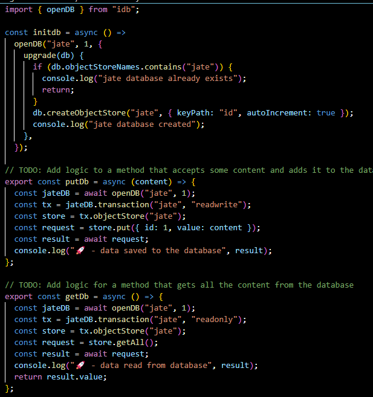
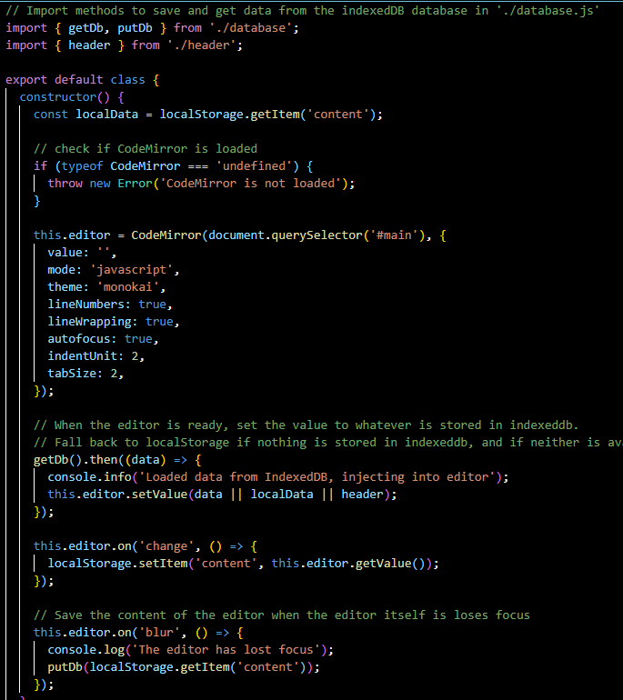
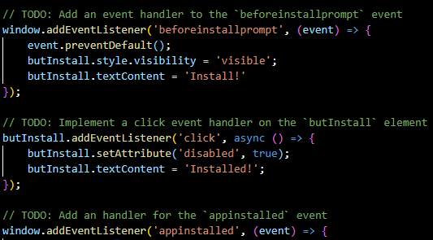

# PWA-Text-Editor

## Table of Contents
- [Overview](#overview)
- [Screenshots](#screenshots)
- [Links](#links)
- [License](#license)

### Overview
The Text Editor web application is designed to provide a seamless experience for users to create and store notes or code snippets, with or without an internet connection. It leverages modern web technologies, including IndexedDB for data storage and service workers for offline functionality.

### Screenshots

### Links 
Github: https://github.com/ASHLOUISE

Deployed:  https://ashlouise.github.io/PWA-Text-Editor/

